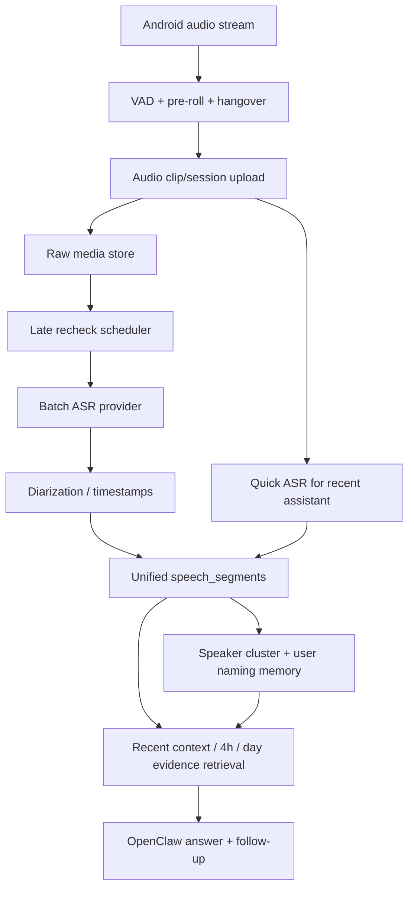

# ClawSense 远场 / 嘈杂 ASR 与 Speaker Diarization 预研

日期：2026-06-01

范围：ClawSense 现实世界语音助手场景，即 Android 旧手机采集现实世界音频、图片、视频片段，云端 OpenClaw 进入证据库并支持语音问答。

## 结论先行

ClawSense 当前最核心的问题不是“有没有一个更强模型能一次性听懂一切”，而是音频链路还没有稳定形成“可追溯、可重试、可分说话人、可跨时间回顾”的证据层。市面上会议转写、远场 ASR、speaker diarization 的通行做法仍然是多阶段流水线：端侧 VAD/分段和质量控制，云端或本地 ASR，diarization，后处理对齐，最后再交给 LLM 做总结和问答。

推荐判断：

- 现在应该引入 speaker diarization，但不要把它作为实时回答的硬前置。MVP 先在服务端对“会议/工位窗口”做 batch diarization，并把结果写入证据库。
- 现在不建议只依赖多模态大模型直接吃音频。它适合实时回答和补充理解，但不适合作为唯一事实层，因为缺少稳定的词级时间戳、speaker 标签、重试机制和跨天可索引结构。
- 远场、嘈杂、断句不准、ASR 漏转可以显著工程缓解，但不能完全消除。单只旧手机放得远、混响强、多人重叠说话时，物理采集边界会成为上限。
- 最适合 ClawSense 的路线是：Android 继续做轻量端侧 VAD 和 sessionization，服务端增加 ASR 二次检查 / late recheck / diarization worker，所有结果进入统一 `speech_segments` 证据层，再由 OpenClaw 使用这些证据回答“刚才 / 过去 4 小时 / 昨天”类问题。

## 市面方案观察

### 会议转写的主流形态

2024-2026 年主流会议转写产品和 API 基本都在做这几件事：

- VAD 或 utterance segmentation：把长音频切成可处理的说话片段。
- ASR：生成 transcript，通常带时间戳。
- Speaker diarization：标出“谁在什么时候说话”，但默认只是 speaker 标签，不等于真人身份。
- 后处理：标点、格式化、章节、摘要、行动项。
- 质量兜底：对长音频进行 batch 重试，或者允许用户上传会议录音后异步处理。

代表性资料：

- Deepgram diarization 文档说明可以为转写词标记 speaker，并与 utterances / timestamps 配合使用：[Deepgram diarization](https://developers.deepgram.com/docs/diarization)、[timestamps / utterances / diarization](https://deepgram.com/learn/working-with-timestamps-utterances-and-speaker-diarization-in-deepgram)。
- AssemblyAI 提供 speaker diarization、speaker labels 和 speech understanding 能力：[AssemblyAI speaker diarization](https://www.assemblyai.com/docs/speech-to-text/speaker-diarization)。
- Azure Speech 支持 conversation transcription、实时 diarization，并明确区分“Guest-1/Guest-2”这类标签和真实身份：[Azure Speech to text](https://ai.azure.com/catalog/models/Azure-Speech-Speech-to-text)、[conversation transcription](https://learn.microsoft.com/azure/ai-services/speech-service/conversation-transcription)。
- Google Cloud Speech-to-Text 支持 speaker diarization，并可返回 word-level speaker tags：[Google speaker diarization](https://cloud.google.com/speech-to-text/docs/speaker-diarization)。
- OpenAI 音频转写模型适合转写 / 翻译 / 时间戳等任务，适合放进 ClawSense 的 provider 抽象中：[OpenAI audio transcription guide](https://platform.openai.com/docs/guides/speech-to-text)。
- DashScope / 阿里云模型服务提供 Paraformer 等中文 ASR 能力，适合中国云端 OpenClaw 用户优先验证：[DashScope Paraformer](https://help.aliyun.com/zh/model-studio/paraformer-api)。

### 开源方案观察

开源方案已经足够支持 ClawSense 做离线或自托管 fallback，但工程成本比商业 API 高：

- WhisperX：基于 Whisper / faster-whisper，增加 VAD、强制对齐、词级时间戳和 pyannote diarization，适合 batch recheck 和研究型验证：[WhisperX](https://github.com/m-bain/whisperX)。
- pyannote.audio：speaker diarization、speaker embedding、overlapped speech detection 生态较成熟，适合构建 speaker cluster / 人物记忆：[pyannote.audio](https://github.com/pyannote/pyannote-audio)、[pyannoteAI docs](https://docs.pyannote.ai/)。
- NVIDIA NeMo / Sortformer：提供 ASR、diarization、speaker verification、overlap 相关模型，适合未来自托管 GPU worker：[NVIDIA NeMo speaker diarization](https://docs.nvidia.com/nemo-framework/user-guide/latest/nemotoolkit/asr/speaker_diarization/intro.html)。
- SpeechBrain：ECAPA-TDNN 等 speaker embedding / speaker recognition 模型可用于 enrollment 和跨片段聚类：[SpeechBrain speaker recognition](https://speechbrain.readthedocs.io/en/latest/API/speechbrain.inference.speaker.html)。
- Silero VAD：轻量 VAD，适合端侧或服务端做切分校验：[Silero VAD](https://github.com/snakers4/silero-vad)。
- WebRTC VAD：传统低成本 VAD，适合移动端实时语音活动检测，但语义边界弱：[WebRTC VAD](https://github.com/wiseman/py-webrtcvad)。
- DeepFilterNet / RNNoise：实时降噪 / speech enhancement，可作为可选增强分支，但不能盲目覆盖原始音频：[DeepFilterNet](https://github.com/Rikorose/DeepFilterNet)、[RNNoise](https://github.com/xiph/rnnoise)。

## 技术路线对比

| 路线 | 优点 | 缺点 | 对 ClawSense 的建议 |
|---|---|---|---|
| 纯云端多模态 / 大模型直接吃音频 | 接入简单，能把图片、上下文、音频一起理解；适合实时问答 | 缺少稳定时间戳和 speaker 标签；成本高；长音频上下文受限；失败后不易补救 | 作为 query-time reasoning 和兜底理解，不作为唯一证据层 |
| 传统 ASR + diarization + LLM 总结 | 可索引、可重试、可审计；容易回答“过去 4 小时聊了什么” | 流水线复杂，需要 provider 抽象和异步任务 | 作为 ClawSense 主线架构 |
| 本地 / 边缘 VAD + 云端 batch ASR | 控制上传量，降低成本；手机端可实时工作 | VAD 错切会造成漏转；需要前后文 buffer 和 session 合并 | MVP 必做，重点修 clip/session 边界 |
| 先降噪 / 分离再 ASR | 对稳态噪声、背景风扇、轻度嘈杂有帮助 | 可能损伤语音；重叠说话难完全分开；引入延迟和算力 | P1 做实验分支，保留原始音频，不要默认覆盖 |
| speaker embedding + 用户后验标注 | 能从 `speaker_1` 过渡到 Amy / 李三；符合产品目标 | 声纹是敏感生物识别信息；跨设备/噪声下不稳定 | P1 引入，必须用户确认后才命名 |
| 会议类商业 API | 工程快，远场和会议转写优化较多 | 成本和隐私压力；不同地区可用性不同；供应商锁定 | MVP 用 provider 插件化接入，优先用户当前云厂商 |
| 开源 WhisperX / pyannote | 可自托管、可控、便于回放测试 | 依赖 GPU/CPU 资源，部署复杂 | 用于测试基线和高级用户自托管，不作为首版默认 |

## Android 端采集策略建议

### 采样率与格式

MVP 推荐：

- 采集或保存为 mono PCM16 WAV，16 kHz 作为 ASR 标准路径。
- 如果 Android 原始输入是 48 kHz，可以保留原始 48 kHz 或 Opus 版本作为增强 / 重跑素材，但服务端 ASR 工作副本统一转 16 kHz mono。
- 网络上传可考虑 Opus，但服务端必须保留可重跑的原始或近原始音频。不要只保留被降噪或强压缩后的结果。

原因：

- 大部分 ASR 对 16 kHz mono 足够，且成本低。
- 降噪、声源分离、speaker embedding 有时更喜欢更高采样率或更少压缩的素材，所以保留原始素材有价值。

### Clip 长度与切分

当前 ClawSense 的问题之一是短句 / 断句 / VAD 边界可能造成“关键字被切掉”。建议：

- 加 `preRollMs`：每个语音 clip 前带 500-1000ms 音频。
- 加 `postRollMs` / hangover：语音结束后继续保留 1000-2000ms。
- 将很短的 voiced clip 合并到最近 session，不要单独转写 1-3 秒碎片。
- 会议 / 工位模式下，优先形成 30-90 秒 session window，再进行 batch ASR。
- 如果连续多个 clip 间隔小于 2-5 秒，服务端 late recheck 时合并成一个 ASR job。

### VAD 策略

端侧 VAD 的目标不是“精准断句”，而是“尽量不漏掉可用语音”。因此：

- VAD 只能决定上传候选，不应成为最终语义边界。
- 端侧可继续记录 `voicedMs`、`peakRms`、`silenceMs`、`clipMs`、`rms`、`vadThreshold`、`continuation` 等质量特征。
- 服务端应重新 sessionize：按时间邻近、设备、模式、音频质量把多个 clip 合成 meeting window。
- 对“我刚才问了什么”这类 assistant query，要和环境音频严格隔离，避免把环境音频误认为用户 query。

### 质量指标

建议每个 audio evidence 增加或确认以下字段：

- `snrEstimate` 或简化版 `noiseFloorRms / speechRms`
- `clippingRatio`
- `silenceRatio`
- `voicedRatio`
- `vadConfidence`
- `distanceHint`：近讲 / 中距 / 远场的启发式标签
- `asrCoverage`：已转写音频时长 / 总语音时长
- `asrStatus`：pending / quick_succeeded / quick_failed / recheck_succeeded / recheck_failed
- `diarizationStatus`

这些指标会直接影响回答质量。例如用户问“过去 4 小时聊了什么”，OpenClaw 不应只根据最近几张图片回答，而应先判断音频覆盖率是否足够。如果覆盖率不足，应明确说“我只有图片和少量音频，不够确认完整对话”。

## 服务端推荐架构

### 统一语音证据层

新增或强化统一 `speech_segments` 概念。无论来自实时 ASR、late recheck、商业 API、WhisperX 还是多模态模型，最后都归一成同一结构：

```ts
type SpeechSegment = {
  id: string;
  deviceId: string;
  sourceEventIds: string[];
  sessionId: string;
  startAt: number;
  endAt: number;
  text: string;
  language?: string;
  speakerLabel?: string;       // speaker_1 / speaker_2
  speakerClusterId?: string;   // 跨片段聚类 ID
  personId?: string;           // 用户确认后的 Amy / 李三
  confidence?: number;
  asrProvider: string;
  diarizationProvider?: string;
  qualityFlags: string[];
};
```

OpenClaw 问答只消费这个统一层，而不是直接消费“某一次模型返回的 summary”。这能解决用户当前遇到的几个问题：

- 问“过去 4 小时”时，不会只看最近 60 秒 recent context。
- 问“刚才沟通重点”时，可以同时取最近图片、OCR、音频 transcript、speaker 信息。
- 如果 quick ASR 漏转，late recheck 成功后同一个问题可以自然变好。

### Quick ASR + Late Recheck

推荐两级：

1. Quick ASR：用于实时助手，尽快返回“我听到的大概内容”。
2. Late recheck：异步处理最近 5 分钟、4 小时、当天等较大窗口，补足 transcript、时间戳和 speaker。

触发 late recheck 的条件：

- 用户问“刚才说了什么 / 过去 4 小时聊了什么 / 昨天发生了什么”但 transcript 覆盖率低。
- 某个 session 中音频事件多，但 transcript 很少。
- ASR 失败原因包含 `empty`、`input_format_error`、`provider_error`、`low_confidence`。
- 会议模式或工位模式检测到高语音密度。

late recheck 的最小实现：

- 合并同一设备、相邻时间、同一 session 的音频 clip。
- 调用支持 timestamps 的 ASR provider。
- 如果 provider 支持 diarization，开启 diarization。
- 写回 `speech_segments`。
- 更新 related windows 的 `transcriptCoverage`。

### Provider 选择

首版不要把某个商业 API 写死。建议用 provider strategy：

- 中国云端用户优先：DashScope / 阿里云 ASR，验证 Paraformer 中文远场表现和 diarization 支持。
- 国际用户可选：Deepgram、AssemblyAI、Azure、Google、OpenAI。
- 开源 fallback：WhisperX + pyannote，用于本地测试、私有化部署或高级用户。

一个务实的优先级：

1. 保留当前多模态 / OpenAI-compatible audio 路径作为 quick path。
2. 新增 `asr.recheckProvider` 配置，优先接入一个 batch ASR + diarization provider。
3. 将 WhisperX/pyannote 做成可选 worker，不阻塞 MVP。

## Speaker Diarization 与人物记忆

### 是否现在引入 diarization？

应该现在引入，但只引入“证据层 diarization”，不要过早承诺“稳定认出 Amy”。

理由：

- ClawSense 的核心价值是回顾会议、工位来访、人物关系和任务落点。没有 speaker 信息，很多问题无法回答，例如“刚才 Amy 说了什么”“任务落给谁”。
- diarization 可以先解决“谁和谁说话的边界”，即便还不知道真实姓名。
- 用户后验标注是自然产品路径：系统先说 speaker_1 / speaker_2，用户说“speaker_1 是 Amy”，然后后续记忆升级。

不建议现在做的事：

- 不要把 speaker_1 直接跨天当作同一个人。
- 不要在没有用户确认时猜真实身份。
- 不要把声纹 embedding 暴露成普通日志或长期明文保存。

### 推荐路线

MVP：

- batch ASR provider 支持 diarization 时直接使用 provider speaker labels。
- 对每个 meeting/session 内生成 `speaker_1`、`speaker_2`。
- 问答中展示“疑似 speaker_1 / speaker_2”，并鼓励用户标注。
- 用户标注后，保存 `speakerLabel -> personName/personId` 的 session-level mapping。

P1：

- 增加 speaker embedding 聚类。
- 对已标注 speaker 的音频片段提取 embedding，形成 `voiceprintCluster`。
- 后续新 session 中出现相似 speaker 时，只给“可能是 Amy”的低风险提示，必须带置信度。
- 用户确认后再升级为已确认人物。

P2：

- 支持多设备 / 多麦克风定位。
- 支持 overlap speech detection，重叠语音单独标记为低置信。
- 支持用户删除某个人物声纹、导出和过期。

### 从 speaker 到人物记忆的结构

建议分三层：

1. `speakerLabel`：某次 ASR/diarization 结果中的临时标签，例如 `speaker_1`。
2. `speakerClusterId`：跨片段聚类 ID，例如 `cluster_20260601_a7f3`。
3. `personId`：用户确认的人物，例如 `person_amy`。

只有 `personId` 才能在回答中直接叫 Amy / 李三。`speakerClusterId` 只能用于候选和追问，例如：

- “我听到一个和上次 Amy 声音相似的人，但还不确定。”
- “这段里的 speaker_2 可能是你之前标注过的李三，要我记下来吗？”

## 嘈杂、距离远、断句不准、漏转：能解决到什么程度？

### 可以工程缓解的部分

嘈杂：

- 用 VAD 阈值自适应、噪声地板估计、batch recheck 改善。
- 对稳态噪声可尝试 DeepFilterNet / RNNoise 等增强。
- 选择更适合会议 / 远场的 ASR provider。

距离远：

- 提高 clip 长度和前后文，减少断裂。
- 用更强 batch ASR 重跑。
- 提醒用户手机摆放位置：离主要说话人更近，麦克风朝外，不要放包里或衣物下。
- 未来支持外接麦克风或多手机。

断句不准：

- 加 pre-roll / hangover。
- 服务端按 session 合并重跑。
- 不把 VAD 边界当语义边界。
- 用 ASR word timestamps 和 punctuation 重建句子。

ASR 漏转：

- 建立 transcript coverage 指标。
- 当用户追问时触发 late recheck。
- 对失败音频保留原始文件并支持换 provider 重跑。
- 对“无转写但有 voicedMs”的窗口在回答中显式暴露缺口。

Speaker 区分：

- 会议窗口级 diarization 可以较快提升。
- 跨天人物识别需要 speaker embedding + 用户确认。
- 重叠说话和远场混响会降低可靠性，需要置信度和缺口表达。

### 物理边界

以下问题不能只靠软件完全解决：

- 旧手机离说话人太远，信噪比很低。
- 手机放在口袋、包里、桌面反扣，声音被遮挡。
- 多人同时说话，且音量接近。
- 强混响房间、开放办公区、旁边有持续背景人声。
- 录音本身被系统权限、电量管理、后台限制中断。

因此产品上必须允许回答“不确定”，并把“不确定原因”讲清楚。ClawSense 的可信度来自证据透明，而不是强行编一个总结。

## 面向 ClawSense 的推荐架构



### MVP 怎么改

MVP 目标：先让“过去 4 小时聊了什么 / 刚才讨论重点 / 谁说了什么”有可靠证据基础。

必须做：

- Android clip 增加 pre-roll / hangover，减少切词。
- 服务端增加 audio session merge，把碎片音频合并成 30-90 秒窗口。
- 增加 `asrStatus / transcriptCoverage / transcriptSegments`。
- 新增 late recheck worker：当窗口音频多但 transcript 少时自动重跑。
- 若 provider 支持 diarization，开启 session-level diarization。
- 问答检索按用户问题选择时间范围：最近 60 秒、5 分钟、4 小时、昨天，而不是永远 recent context。
- 回答中区分“已确认 transcript”和“图片/OCR 推断”，避免只看图片回答音频问题。

### vNext 怎么改

vNext 目标：从“可转写可回顾”升级为“可长期识别人际关系和任务脉络”。

建议：

- 增加 speaker embedding / clustering worker。
- 建立人物记忆表：`personId`、别名、角色、确认来源、相关 speaker clusters。
- 用户可说“speaker_1 是 Amy”，系统把这次 session 的 speaker 绑定人物。
- 后续回答自然使用人名，但带置信度策略。
- 增加音频增强实验分支，比较原始音频和增强音频的 ASR WER / transcript coverage。
- 引入 overlap speech detection，把多人重叠说话片段标为低可信。
- 对会议模式生成结构化产物：主题、决策、任务、风险、人物观点、未确认缺口。

## 隐私与合规风险

ClawSense 的风险等级很高，因为它处理持续环境录音、可能涉及同事、客户、课堂、会议和声纹信息。

必须注意：

- 声纹 / speaker embedding 属于高度敏感信息，很多地区可能被视为生物识别数据。
- 工作场所录音涉及同意、告知、公司制度、客户合同和当地法律。
- 会议、课堂、聚会场景都可能涉及第三方隐私。
- 默认不要无限保留原始音频。应支持用户设置保留期、删除、导出和关闭。
- 对外发布时必须有明确隐私说明：采集什么、传到哪里、保留多久、如何删除、是否用于模型训练。
- 回答中不要把低置信 speaker 猜测包装成事实。

建议产品策略：

- 默认保留原始媒体 7 天，用户可改。
- 默认不开启长期声纹身份，只有用户主动标注后才保存人物记忆。
- 所有声纹相关数据加密存储，支持删除。
- 在 UI 明确显示正在录音/感知状态。

## 成本、延迟、复杂度评估

| 能力 | 成本 | 延迟 | 复杂度 | 建议 |
|---|---:|---:|---:|---|
| Android pre-roll / hangover | 低 | 低 | 低 | P0 |
| 服务端 session merge | 低 | 低 | 中 | P0 |
| Quick ASR | 中 | 低 | 中 | P0 |
| Batch late recheck | 中 | 中 | 中 | P0 |
| 商业 diarization | 中-高 | 中 | 中 | P1/P0 可选 |
| WhisperX + pyannote 自托管 | 中-高 | 高 | 高 | P1 实验 |
| 音频增强 | 低-中 | 中 | 中 | P1 实验 |
| Speaker embedding 人物记忆 | 中 | 中 | 高 | P1 |
| Overlap speech separation | 高 | 高 | 高 | P2 |
| 多设备 / 外接麦克风 | 中-高 | 低 | 高 | P2 |

## 特别回答 1：现在是否应该引入 speaker diarization？

应该引入，但方式要克制。

首选路线：服务端 batch diarization，按 meeting/session window 处理，不要在 Android 端做，也不要把它作为实时语音问答的硬依赖。

为什么：

- Android 旧手机算力、电量、后台稳定性都不适合做重 diarization。
- provider diarization 或 WhisperX/pyannote batch 更容易获得时间戳和 speaker 边界。
- ClawSense 最需要的是“回顾时知道谁说了什么”，这可以异步完成。
- 实时问答仍可先用 recent transcript 回答，late recheck 完成后补强。

MVP 第一版可以只保证：

- 同一个窗口内 speaker_1 / speaker_2 相对稳定。
- 用户可以把 speaker_1 标注成 Amy。
- 标注后这段历史回答用 Amy，不跨天盲目泛化。

## 特别回答 2：能否显著缓解嘈杂、距离远、断句不准、ASR 漏转？

可以显著缓解，但不能保证“所有所有所有语音细节”都完整拿到。

最有效的工程组合是：

- 端侧 pre-roll + hangover，减少切词。
- 服务端 session merge，把碎片重组为完整对话窗口。
- Quick ASR + late recheck，先快后准。
- transcript coverage 指标，发现漏转主动重跑。
- provider fallback，多模型 / 多 provider 重试。
- 会议窗口级 diarization，让回顾从“模糊摘要”变成“谁说了什么”。
- 必要时音频增强实验，但始终保留原始音频。

无法完全解决的边界：

- 手机离得太远导致语音能量不足。
- 多人同时说话且声音混在一起。
- 环境背景人声比目标人声更清楚。
- 设备被衣物、包、桌面遮挡。
- 用户所在公司或场景不允许录音。

## ClawSense 下一步实施建议清单

### P0：马上做，直接影响当前 MVP

- 建立 `speech_segments` 统一证据层，把 quick ASR、late recheck、diarization 都归一进去。
- Android 音频 clip 增加 `preRollMs` 和 `postRollMs/hangoverMs`，并记录到 metadata。
- 服务端实现 audio session merge：按设备、时间邻近、sessionId 合并 30-90 秒窗口。
- 增加 `transcriptCoverage` 和 `asrStatus`，问答时优先检查音频覆盖率。
- 新增 late recheck worker：对“有音频但 transcript 少”的窗口自动重跑 ASR。
- 修正问答检索策略：用户问“昨天 / 过去 4 小时 / 刚才”时，按问题时间范围取证据，不要只取 recent context。
- 回答模板区分：音频 transcript、图片 caption、OCR、推断、缺口。

### P1：下一阶段做，形成会议 / 工位差异化价值

- 接入一个支持 diarization 的 batch ASR provider，先走 provider built-in diarization。
- 保存 session-level `speaker_1/speaker_2`，支持用户标注“speaker_1 是 Amy”。
- 建立 `personId` / `speakerClusterId` / `speakerLabel` 三层模型。
- 做 WhisperX + pyannote 离线 replay，用公开会议/课堂素材评估基线。
- 引入音频增强 A/B：原始音频 ASR vs 增强音频 ASR，对比 transcript coverage 和人工可读性。
- 支持“低置信 / 重叠说话 / 远场不清晰”质量标签进入回答。

### P2：更长期，接近全天候助理

- speaker embedding 跨天聚类和用户确认式人物记忆。
- overlap speech detection / source separation。
- 多设备协同或外接麦克风支持。
- streaming ASR 用于更低延迟实时对话。
- 会议产物自动沉淀：纪要、任务、人物观点、待确认点、可导出文档。
- 更完整的隐私控制台：保留期、删除、导出、声纹开关、场景白名单。

